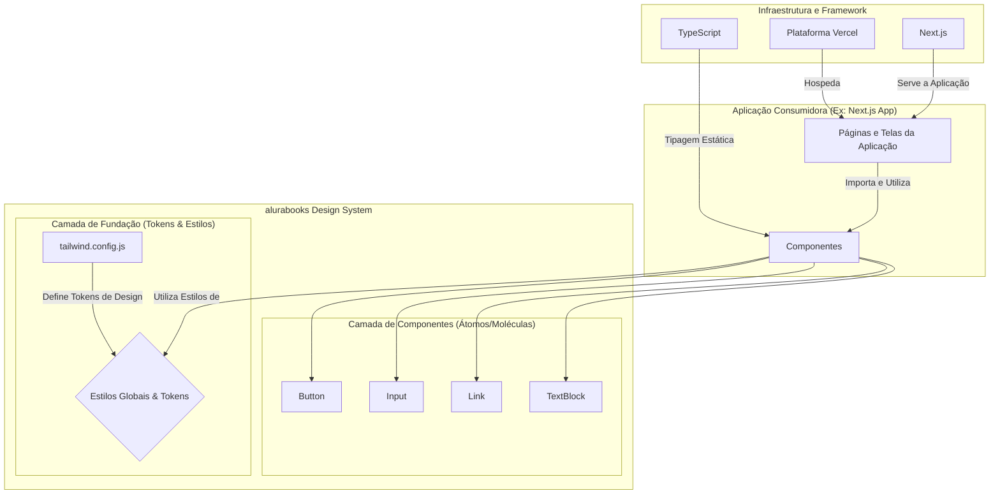

---

# ALURABOOKS DESIGN SYSTEM: Um Framework de Componentes para Interfaces Modulares

*Orquestrando Consistência e Escalabilidade Visual com Precisão Atômica.*

---

## Abstract (Resumo Técnico)

No contexto do desenvolvimento web contemporâneo, a demanda por interfaces de usuário (UI) que sejam simultaneamente consistentes, escaláveis e de fácil manutenção representa um desafio de engenharia significativo. A proliferação de componentes e estilos inconsistentes em aplicações complexas frequentemente resulta em débito técnico, degradação da experiência do usuário e ciclos de desenvolvimento lentos. O **alurabooks design system** aborda este problema fundamental ao propor um sistema de design coeso e uma biblioteca de componentes reutilizáveis, concebida para ser a fonte canônica da verdade visual e interativa de um ecossistema de produtos digitais.

Este projeto materializa-se como uma biblioteca de componentes React, desenvolvida com base em um stack tecnológico moderno que inclui Next.js, TypeScript e TailwindCSS. A metodologia central adota princípios de design atômico, onde componentes fundamentais (Átomos e Moléculas) como `Button`, `Input`, `Link` e `TextBlock` são projetados para serem composicionais, flexíveis e robustos. A utilização de TypeScript garante a segurança de tipos e a autogeração de documentação para as APIs dos componentes, enquanto o TailwindCSS oferece uma abordagem de estilização utilitária que promove consistência e customização através de tokens de design centralizados. A contribuição principal do projeto reside na demonstração de uma arquitetura de design system robusta, desde a definição de componentes até o seu fluxo de desenvolvimento, teste visual e implantação, servindo como um artefato de referência para a construção de UIs de alta qualidade.

## Badges Abrangentes


## Demonstração Visual


## Sumário (Table of Contents)

1. [Introdução e Motivação](#-introdução-e-motivação)
2. [Arquitetura do Sistema](#-arquitetura-do-sistema)
3. [Decisões de Design Chave](#-decisões-de-design-chave)
4. [✨ Funcionalidades Detalhadas](#-funcionalidades-detalhadas)

   * [Componente: Button](#componente-button)
   * [Componente: Input](#componente-input)
   * [Componente: Link](#componente-link)
   * [Componente: TextBlock](#componente-textblock)
5. [🛠️ Tech Stack Detalhado](#️-tech-stack-detalhado)
6. [📂 Estrutura Detalhada do Código-Fonte](#-estrutura-detalhada-do-código-fonte)
7. [📋 Pré-requisitos Avançados](#-pré-requisitos-avançados)
8. [🚀 Guia de Instalação e Configuração Avançada](#-guia-de-instalação-e-configuração-avançada)
9. [⚙️ Uso Avançado e Exemplos](#️-uso-avançado-e-exemplos)
10. [🔧 API Reference (Props dos Componentes)](#-api-reference-props-dos-componentes)
11. [🧪 Estratégia de Testes e Qualidade de Código](#-estratégia-de-testes-e-qualidade-de-código)
12. [🚢 Deployment Detalhado e Escalabilidade](#-deployment-detalhado-e-escalabilidade)
13. [🤝 Contribuição](#-contribuição)
14. [📜 Licença e Aspectos Legais](#-licença-e-aspectos-legais)
15. [📚 Publicações, Artigos e Citações](#-publicações-artigos-e-citações)
16. [👥 Equipe Principal e Colaboradores Chave](#-equipe-principal-e-colaboradores-chave)
17. [❓ FAQ (Perguntas Frequentes)](#-faq-perguntas-frequentes)
18. [📞 Contato e Suporte](#-contato-e-suporte)

## 📖 Introdução e Motivação

A complexidade crescente das aplicações web modernas introduziu desafios significativos na gestão da interface do usuário. Sem uma estratégia deliberada, as equipes de desenvolvimento frequentemente enfrentam uma "crise de UI", caracterizada por inconsistência visual, duplicação de código, dificuldade de manutenção e uma desconexão entre o design proposto e a implementação final. Esses problemas não apenas geram débito técnico, mas também comprometem a experiência do usuário e a identidade da marca.

O **alurabooks design system** foi concebido para mitigar esses desafios, estabelecendo uma "fonte única da verdade" para todos os elementos da interface. A proposta de valor central é fornecer um vocabulário visual e interativo compartilhado, encapsulado em componentes de software robustos e reutilizáveis. Ao fazer isso, o projeto visa:

* **Acelerar o Desenvolvimento:** Permitir que desenvolvedores construam interfaces complexas rapidamente, compondo-as a partir de blocos de construção pré-fabricados e testados.
* **Garantir Consistência:** Assegurar que todos os produtos e funcionalidades que consomem o sistema de design tenham uma aparência e comportamento uniformes.
* **Facilitar a Colaboração:** Criar uma linguagem comum entre designers, desenvolvedores e gerentes de produto.
* **Promover a Escalabilidade:** Fornecer uma base sólida que pode evoluir de forma controlada, permitindo que novas funcionalidades e produtos sejam adicionados sem introduzir inconsistências ou retrabalho.

A motivação para este projeto vai além da simples criação de uma biblioteca de UI. Trata-se de uma exploração de boas práticas na engenharia de sistemas de design, investigando a sinergia entre ferramentas como TypeScript e TailwindCSS para criar um fluxo de trabalho de desenvolvimento de componentes que seja eficiente, seguro e bem documentado.

## 🏛️ Arquitetura do Sistema

A arquitetura do **alurabooks design system** é fundamentada em componentes React reutilizáveis, centralizando todos os recursos de UI, estilos e tokens de design em um único local para fácil manutenção.



## ⚖️ Decisões de Design Chave

* **Next.js como Framework:** Integração nativa com React, SSR/SSG, ecossistema robusto.
* **TypeScript para Type Safety:** Interfaces explícitas, menos erros em tempo de execução, melhor DX.
* **TailwindCSS para Estilização:** Utility-first, configurações centralizadas, CSS enxuto.
* **Estrutura Modular por Componente:** Cada componente tem sua pasta, facilitando manutenção e escalabilidade.

## ✨ Funcionalidades Detalhadas

* **Button:** múltiplas variantes visuais, tamanhos, loading, desabilitado, ícones, feedback visual.
* **Input:** variantes visuais, validação, helper text, multiline, ícones, loading, desabilitado.
* **Link:** variações visuais, detecção automática de links externos, estados e ícones.
* **TextBlock:** variantes visuais, tamanhos, ícone de destaque, botão de ação, animações.

## 🛠️ Tech Stack Detalhado

| Categoria       | Tecnologia  | Versão | Função                        |
| --------------- | ----------- | ------ | ----------------------------- |
| **Framework**   | Next.js     | 14.2.3 | Estrutura da aplicação        |
| **UI**          | React       | ^18    | Componentização declarativa   |
| **Linguagem**   | TypeScript  | ^5     | Tipagem estática              |
| **Estilização** | TailwindCSS | ^3.4.1 | Utility-first, tokens globais |
| **Linting**     | ESLint      | ^8     | Qualidade e padrão de código  |
| **Deployment**  | Vercel      | N/A    | Deploy automatizado           |

## 📂 Estrutura Detalhada do Código-Fonte

```
alurabooks/
├── components/
│   ├── Button/
│   ├── Input/
│   ├── Link/
│   └── TextBlock/
├── pages/
│   ├── _app.tsx
│   ├── _document.tsx
│   └── index.tsx
├── public/
├── styles/
│   └── globals.css
├── video/
│   └── alurabooks.gif
├── package.json
├── tailwind.config.js
├── tsconfig.json
└── LICENSE
```

## 📋 Pré-requisitos Avançados

* Node.js `^18.0` ou `^20.0`
* NPM `^9.0+` ou Yarn/pnpm equivalentes
* Git
* Editor de código (VSCode recomendado com ESLint, Prettier, Tailwind IntelliSense)

## 🚀 Guia de Instalação e Configuração Avançada

```bash
git clone https://github.com/ESousa97/alurabooks.git
cd alurabooks
npm install
npm run dev
```

Acesse [http://localhost:3000](http://localhost:3000) para ver a aplicação de exemplo.

## ⚙️ Uso Avançado e Exemplos

```tsx
import Button from "@/components/Button/Button";
import Input from "@/components/Input/Input";
import { FiUser, FiMail } from "react-icons/fi";

const ContactForm = () => (
  <form className="space-y-6 w-full max-w-md">
    <Input label="Nome Completo" placeholder="Digite seu nome" leftIcon={<FiUser />} variant="outlined" />
    <Input type="email" label="Seu Melhor E-mail" placeholder="contato@exemplo.com" leftIcon={<FiMail />} variant="outlined" helperText="Nós nunca compartilharemos seu e-mail." />
    <Input label="Sua Mensagem" placeholder="Deixe sua mensagem aqui..." multiline variant="outlined" />
    <Button type="submit" fullWidth size="lg">Enviar Mensagem</Button>
  </form>
);
```

## 🔧 API Reference (Props dos Componentes)

### `ButtonProps`

| Propriedade    | Tipo      | Valores                                      | Padrão  | Descrição              |
| -------------- | --------- | -------------------------------------------- | ------- | ---------------------- |
| `variant`      | string    | primary, secondary, tertiary, ghost, outline | primary | Visual                 |
| `size`         | string    | sm, md, lg, xl                               | md      | Tamanho                |
| `loading`      | boolean   | true, false                                  | false   | Spinner e desabilitado |
| `disabled`     | boolean   | true, false                                  | false   | Desabilitado           |
| `fullWidth`    | boolean   | true, false                                  | false   | Largura total          |
| `icon`         | ReactNode |                                              |         | Ícone                  |
| `iconPosition` | string    | left, right                                  | left    | Posição do ícone       |

### `InputProps`

| Propriedade  | Tipo      | Valores                   | Padrão  | Descrição        |
| ------------ | --------- | ------------------------- | ------- | ---------------- |
| `variant`    | string    | default, filled, outlined | default | Visual           |
| `size`       | string    | sm, md, lg                | md      | Tamanho          |
| `label`      | string    |                           |         | Rótulo           |
| `error`      | string    |                           |         | Erro             |
| `success`    | boolean   | true, false               | false   | Sucesso          |
| `multiline`  | boolean   | true, false               | false   | Textarea         |
| `helperText` | string    |                           |         | Texto auxiliar   |
| `leftIcon`   | ReactNode |                           |         | Ícone à esquerda |
| `rightIcon`  | ReactNode |                           |         | Ícone à direita  |

## 🧪 Estratégia de Testes e Qualidade de Código

* **Linting:** `npm run lint` (ESLint configurado)
* **Testes de componentes:** Isolados e em contexto Next.js

## 🚢 Deployment Detalhado e Escalabilidade

* **Deploy automatizado:** Vercel
* **Escalabilidade:** Serverless, Edge Network, otimização automática de recursos

## 🤝 Contribuição

Este é um projeto de código-fonte visível, mas de desenvolvimento fechado. Conforme especificado na licença, contribuições externas não são aceitas. Feedback é bem-vindo via **[issues](https://github.com/ESousa97/alurabooks/issues)**.

## 📜 Licença e Aspectos Legais

Licença customizada. Veja o arquivo [LICENSE](https://github.com/ESousa97/alurabooks/blob/main/LICENSE).

* **Permitido:** Uso privado e comercial, modificações para uso próprio
* **Proibido:** Redistribuição, sublicenciamento, venda ou aceitação de contribuições sem permissão do autor

## 📚 Publicações, Artigos e Citações

Não aplicável a este projeto.

## 👥 Equipe Principal e Colaboradores Chave

**Autor e Desenvolvedor Principal:**
[Enoque Sousa](https://www.linkedin.com/in/enoque-sousa-bb89aa168/) • [GitHub](https://github.com/ESousa97)

## ❓ FAQ (Perguntas Frequentes)

* **Qual a diferença entre rodar `npm run dev` e outros comandos de build?**
  `npm run dev` inicia a aplicação de exemplo Next.js com os componentes.

* **Posso usar estes componentes no meu projeto?**
  Sim, conforme a licença (veja acima).

* **Como adicionar um novo tema de cores?**
  Edite `tailwind.config.js` e crie as classes de utilitários correspondentes.

## 📞 Contato e Suporte

* **Issues e Sugestões:** [https://github.com/ESousa97/alurabooks/issues](https://github.com/ESousa97/alurabooks/issues)
* **Contato Profissional:** [LinkedIn](https://www.linkedin.com/in/enoque-sousa-bb89aa168/)

---

> ✨ **Criado em:** 25 de set. de 2024 às 21:19

---
